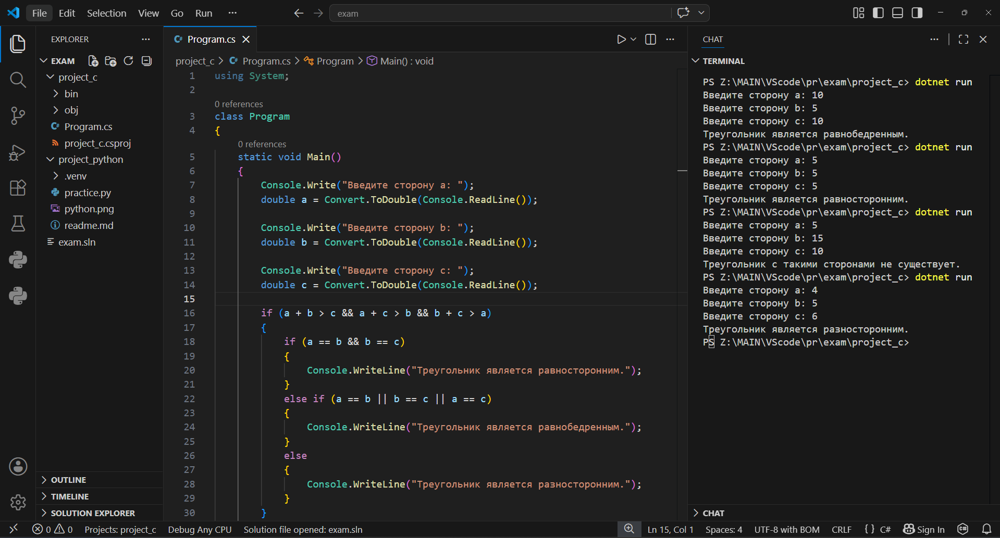
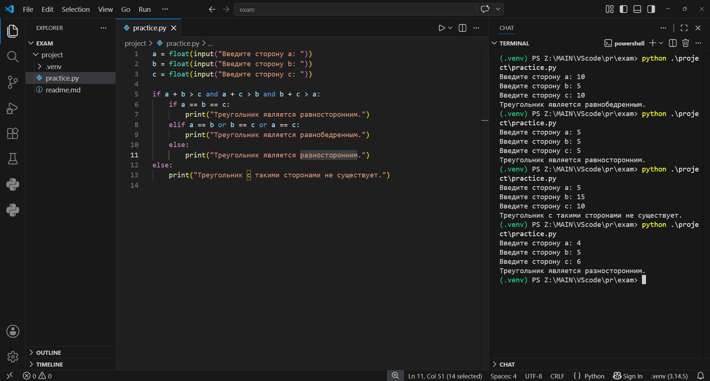

# Мдк 01.04 Системное программирование
# Экзамен 12.05
Специальность: ИП  
Выполнил: Крапивный Александр Владимирович

# Задание
**7. Треугольник**
Пользователь вводит три стороны треугольника. Определить, является ли треугольник равносторонним, равнобедренным или разносторонним.

Решение csharp
```csharp
using System;

class Program
{
    static void Main()
    {
        Console.Write("Введите сторону a: ");
        double a = Convert.ToDouble(Console.ReadLine());

        Console.Write("Введите сторону b: ");
        double b = Convert.ToDouble(Console.ReadLine());

        Console.Write("Введите сторону c: ");
        double c = Convert.ToDouble(Console.ReadLine());

        if (a + b > c && a + c > b && b + c > a)
        {
            if (a == b && b == c)
            {
                Console.WriteLine("Треугольник является равносторонним.");
            }
            else if (a == b || b == c || a == c)
            {
                Console.WriteLine("Треугольник является равнобедренным.");
            }
            else
            {
                Console.WriteLine("Треугольник является разносторонним.");
            }
        }
        else
        {
            Console.WriteLine("Треугольник с такими сторонами не существует.");
        }
    }
}
```
C#


Решение python
```python
a = float(input("Введите сторону a: "))
b = float(input("Введите сторону b: "))
c = float(input("Введите сторону c: "))

if a + b > c and a + c > b and b + c > a:
    if a == b == c:
        print("Треугольник является равносторонним.")
    elif a == b or b == c or a == c:
        print("Треугольник является равнобедренным.")
    else:
        print("Треугольник является разносторонним.")
else:
    print("Треугольник с такими сторонами не существует.")

```
Python
